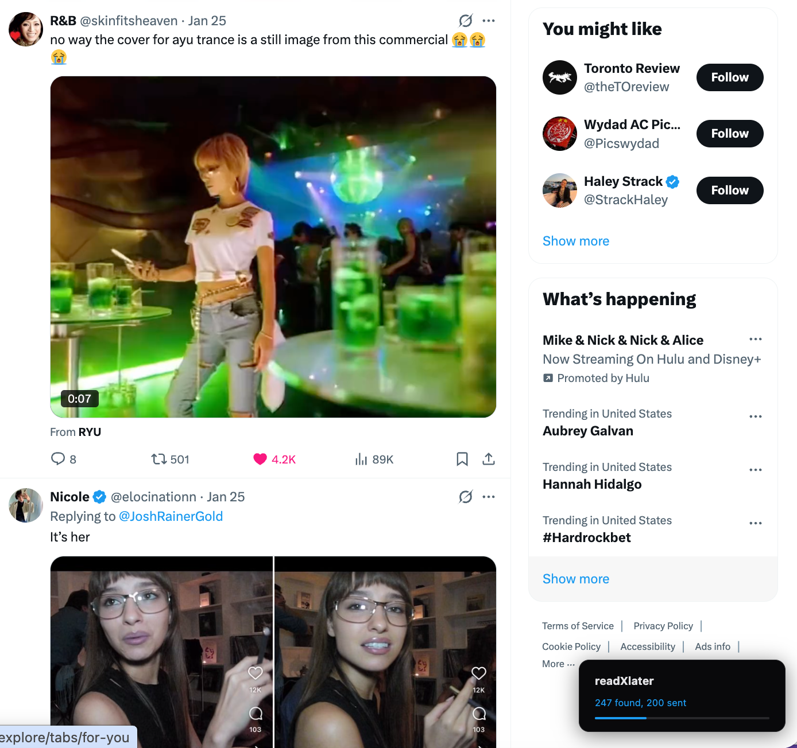
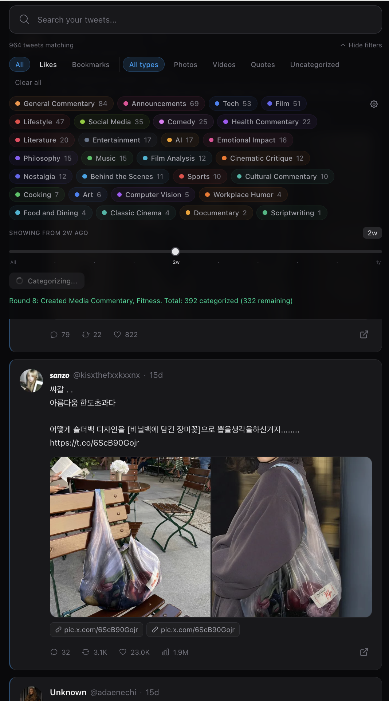
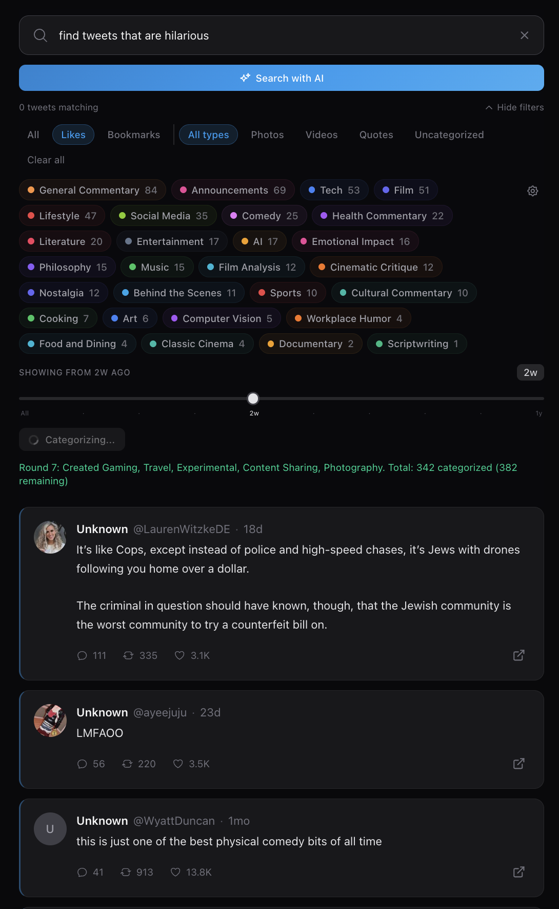
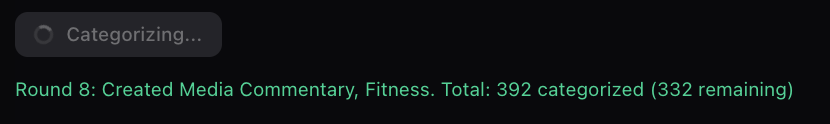

```
                     _  __  _       _
  _ __ ___  __ _  __| |\ \/ / __ _| |_ ___ _ __
 | '__/ _ \/ _` |/ _` | \  / / _` | __/ _ \ '__|
 | | |  __/ (_| | (_| | /  \ (_| | ||  __/ |
 |_|  \___|\__,_|\__,_|/_/\_\__,_|\__\___|_|

              your tweets, actually findable.
```

> a chrome extension + web app that syncs your Twitter likes and bookmarks, auto-categorizes them with AI, and lets you search everything. zero API costs. built for real use.

[](LICENSE)
[](https://docs.anthropic.com/en/docs/claude-code)
[](https://nextjs.org)
[](https://typescriptlang.org)

## the problem

you liked a tweet three weeks ago about that thing you needed. you can't find it. Twitter's native search doesn't search your likes. your bookmarks are a graveyard of good intentions. you've saved thousands of tweets and you can't retrieve any of them when you actually need them.

the Twitter API costs money. basic tier is $100/month for read access. you hit rate limits constantly. and the data you get back is your own data that you already generated by hitting the like button.

readXlater solves both problems. a chrome extension scrolls your Twitter likes page automatically and extracts tweets from the DOM. no API keys. no rate limits. no cost. AI categorizes everything into searchable topics. you search your likes the way you search your email.

## table of contents

- [how it works](#how-it-works)
- [quick start](#quick-start)
- [the extension](#the-extension)
- [the web app](#the-web-app)
- [features](#features)
- [project structure](#project-structure)
- [environment variables](#environment-variables)
- [deployment](#deployment)
- [api routes](#api-routes)
- [database](#database)
- [contributing](#contributing)
- [license](#license)

## how it works

three pieces. the extension collects tweets. the backend stores and categorizes them. the frontend lets you search and browse.

| layer | what it does | how |
|-------|-------------|-----|
| **chrome extension** | scrolls your Twitter likes/bookmarks page, extracts tweets from the DOM, sends to backend | manifest v3, content script injection, auto-scroll loop |
| **backend** | stores tweets, runs AI categorization, handles search | next.js 15 API routes, supabase (postgres), openai gpt-4o-mini |
| **frontend** | search, filter, browse your organized tweet library | next.js app router, tailwind, dark mode, mobile-responsive |

the extension opens `x.com/{yourhandle}/likes` in a foreground tab. it scrolls to the bottom repeatedly, extracting tweet data from `article[data-testid="tweet"]` elements as they render. batches of 50 tweets get POSTed to the backend with JWT auth. when no new tweets appear after several scrolls, it stops and closes the tab.

this means you're reading the same DOM you see when you manually scroll Twitter. no API. no rate limits. zero cost.

## quick start

### 1 minute: AI-assisted setup (recommended)

if you're using Claude Code, Cursor, Windsurf, or any AI coding assistant, copy the prompt from [`SETUP_PROMPT.md`](SETUP_PROMPT.md) and paste it in. the AI will walk you through every step — creating accounts, running migrations, filling env vars, building the extension.

### 5 minutes: manual setup

```bash
git clone https://github.com/YOUR_USERNAME/readxlater.git
cd readxlater
pnpm install

# set up supabase (see environment variables below)
# run migrations in supabase/migrations/ in order

cd apps/web
cp .env.example .env.local
# fill in your keys
pnpm dev
```

open http://localhost:3000. no login needed — it's your local machine.

### 10 minutes: install the chrome extension

```bash
cd apps/extension
npx tsx build.ts
```

1. open `chrome://extensions`, enable Developer Mode
2. click "Load unpacked", select the `apps/extension` folder
3. click the extension icon in the toolbar
4. enter your Twitter @handle
5. enter the `API_KEY` from your `.env.local` file
6. set backend URL (defaults to `http://localhost:3000`)
7. click "Sync Likes & Bookmarks"

a tab opens. it scrolls. tweets flow into your library. you walk away.

### 15 minutes: categorize everything

click the "Categorize" button in your library. AI reads each tweet and assigns 1-2 categories. new categories are created automatically when the AI encounters topics that don't fit existing ones. 30 tweets per batch, loops until everything is categorized.

## the extension

the chrome extension is the entire data ingestion pipeline. no Twitter API involved.

**what happens when you click sync:**

1. extension opens `x.com/{yourhandle}/likes` in a foreground tab
2. waits 2 seconds for initial load
3. scrolls to `document.body.scrollHeight` every 600ms
4. extracts tweet data from every `article` element: text, author, media, metrics, timestamp, tweet ID
5. deduplicates by tweet ID (Set)
6. sends batches of 50 to `/api/tweets/ingest` with Bearer token auth
7. stops after 6 consecutive scrolls with no new tweets
8. closes the tab, repeats for bookmarks if selected

**what it extracts per tweet:**

- tweet ID (from `/status/{id}` links)
- author handle + display name (from profile links)
- avatar URL (from `img[src*="profile_images"]`)
- full tweet text (from `div[data-testid="tweetText"]`)
- timestamp (from `time[datetime]`)
- photos (from `pbs.twimg.com/media` URLs)
- videos (from `video` elements)
- metrics (from button `aria-label` attributes)
- tweet type (tweet, retweet, quote)

**the tab must be in the foreground.** chrome throttles background tabs and Twitter won't render new tweet DOM elements in a hidden tab. you'll see the page scrolling. this is by design.


*the readXlater overlay shows live progress while scrolling your likes page.*

## self-healing selectors

Twitter changes their DOM periodically. class names shift, `data-testid` attributes get renamed, structure changes. when that happens, the scraper silently extracts 0 tweets. readXlater handles this automatically.

### how it works

all CSS selectors used by the scraper are stored in a config (not hardcoded). the extension has three layers of protection:

**1. selector config** (`apps/extension/src/selectors.ts`)

every selector the scraper uses is defined in a config object stored in `chrome.storage`. the scraper reads from this config at runtime. you can update selectors without rebuilding the extension.

```
tweetArticle: article[data-testid="tweet"], article[role="article"]
tweetText:    div[data-testid="tweetText"]
avatar:       img[src*="profile_images"]
statusLink:   a[href*="/status/"]
...
```

**2. inspector** (`apps/extension/src/inspector.ts`)

click "Check Selectors" in the popup. the extension opens a Twitter tab, injects the inspector script, and tests every selector against the live DOM. results show green (found elements) or red (broken) per selector.

run this:
- before your first sync (validates selectors work)
- whenever a sync returns 0 tweets
- after Twitter pushes a major UI update

**3. AI auto-heal** (`/api/selectors/heal`)

when the inspector finds broken selectors, the extension:

1. captures a DOM snapshot of the first tweet article element (raw HTML)
2. sends the broken selectors + DOM snapshot to the backend `/api/selectors/heal` endpoint
3. GPT-4o-mini analyzes the DOM structure and generates updated CSS selectors
4. extension saves the fixed selectors to `chrome.storage`
5. next sync uses the healed selectors automatically

the daily health check alarm runs this flow once per day in the background. if Twitter changes something overnight, your selectors auto-repair before your next sync.

**manual heal:** if auto-heal fails, update the selectors in `apps/extension/src/selectors.ts` and rebuild. the default selectors there serve as the baseline.

## the web app


*the main library — 1,030 tweets organized into 25 auto-generated categories with colored chips, search, filters, and time slider.*

### search

two search modes:

**full-text search** — PostgreSQL `tsvector` across tweet text + author names. triggers at 3 characters with 200ms debounce. `@username` queries use `ilike` for exact author matching.

**AI semantic search** — type a natural language query like "find tweets that are sexy" or "movie files" and click "Search with AI." GPT-4o-mini reads your tweets in batches of 50 and returns the ones that semantically match your intent, even if the exact words aren't there.


*AI semantic search in progress — searching "movie files" across 1,030 tweets.*


*AI search results for "find tweets that are sexy" — finds tweets by meaning, not just keywords.*

### filters

- **source**: all / likes / bookmarks
- **media type**: photos / videos / quotes / uncategorized
- **category**: colored chips that wrap to multiple lines
- **time**: fibonacci slider (All → 1d → 3d → 1w → 2w → 1m → 2m → 3m → 6m → 1y)
- collapsible filter section to save screen space

### the AI categorization engine

this is the core of readXlater. here's exactly how it works:


*Round 1: Created "Investigative Journalism" — 49 tweets categorized, 659 remaining. the AI creates new categories on the fly.*

**how categorization works:**

1. **fetch uncategorized tweets** — pulls 50 uncategorized tweets from the database per round (chunked queries to avoid URL limits)
2. **build the prompt** — includes existing category names, recent user corrections, and category rules. tells the AI: "assign 1-2 categories. use existing ones or create new descriptive names. every tweet must get at least 1 category."
3. **send to GPT-4o-mini** — processes in batches of 10 tweets per API call (5 calls per round). temperature 0.3 for consistency.
4. **parse and insert** — handles every response format the AI might return (array, string, wrapped object, markdown fences). auto-creates new categories with colors from an 18-color palette.
5. **loop until done** — client-side loop runs up to 50 rounds (~2,500 tweets max per click). shows live progress: round number, count, remaining.

**how the AI learns from you:**

when you tap a category badge on a tweet and reclassify it, the system:

1. **asks "why?"** — optional explanation prompt (skip or skip-always available)
2. **stores the correction** — original category, new category, tweet text, your reason. saved in per-user AI memory (JSONB in the users table). max 200 corrections, oldest evicted.
3. **extracts a rule** — if you provide a reason like "this is about investing, not general finance," it becomes a permanent rule: `"This is about investing, not general finance — should go to 'Investing', not 'Finance'."`
4. **feeds back into prompts** — next time the AI categorizes, it reads the last 10 corrections and all rules as few-shot examples. the prompt literally includes your past corrections so the AI doesn't repeat the same mistake.

the result: the more you use it, the better it gets. correction on day 1 prevents the same error on day 30. the system compounds.

### tweet cards

- Twitter-native card design with avatars, author info, metrics
- Twitter blue left border accent
- quote tweet embeds (nested card)
- link preview chips for URLs
- video/GIF thumbnails with play button (links to original tweet for playback)
- bookmark indicator for saved tweets
- reply context label
- category badges (tap to reclassify)
- text truncation at 6 lines

## features

| feature | description |
|---------|-------------|
| extension sync | auto-scroll DOM scraping, zero API cost |
| AI categorization | GPT-4o-mini, 1-2 categories per tweet, auto-create |
| full-text search | PostgreSQL FTS on text + author |
| AI search | semantic search via GPT-4o-mini |
| reclassify | tap badge, pick 1-2 categories, AI learns |
| category management | create, edit, delete, merge, color picker |
| fibonacci slider | non-linear time navigation |
| multi-category | tweets can belong to up to 2 categories |
| quote embeds | quoted tweets render as nested cards |
| link previews | URL chips below tweet text |
| video/GIF | inline playback with controls |
| dark mode | zinc + Twitter blue color scheme |
| mobile-responsive | collapsible filters, compact cards |
| settings persistence | sync preferences saved to DB |
| error handling | expired tokens, rate limits, clear messages |
| stable user ID | works across multiple login sessions |

## project structure

```
apps/
  web/                          # next.js 15 web application
    app/
      api/
        tweets/                 # list, search, ai-search, ingest
        categories/             # CRUD + merge
        categorize/             # AI categorization + remaining count
        corrections/            # reclassification + AI learning
        settings/               # user preferences
        auth/                   # extension token generation
      login/                    # sign in page
      settings/                 # settings + category management
      page.tsx                  # main library page
    components/
      library/                  # library view
      tweets/                   # tweet card, media, metrics, reclassify modal
      search/                   # search bar, category chips, time slider
      categories/               # category manager, form, merge dialog
      layout/                   # header, footer, about section
    lib/
      auth/                     # NextAuth config, stable user ID resolution
      services/                 # categorization, AI memory, tweet ingestion
      twitter/                  # Twitter API client (legacy, not used by extension)
      supabase/                 # admin client, types
  extension/                    # chrome extension (manifest v3)
    src/
      scraper.ts                # DOM extraction + auto-scroll
      background.ts             # tab management, batch orchestration
      popup/                    # popup UI (sync buttons, progress, token input)
      lib/
        auth.ts                 # token + handle storage
        batch-sender.ts         # HTTP batching with retry
    manifest.json
packages/
  shared/                       # shared zod schemas + constants
supabase/
  migrations/                   # 5 SQL migration files
```

## environment variables

create `apps/web/.env.local`:

```env
# supabase
NEXT_PUBLIC_SUPABASE_URL=https://your-project.supabase.co
NEXT_PUBLIC_SUPABASE_ANON_KEY=your-anon-key
SUPABASE_SERVICE_ROLE_KEY=your-service-role-key

# auth (generate with: openssl rand -base64 32)
AUTH_SECRET=your-random-secret
AUTH_URL=http://localhost:3000
AUTH_TRUST_HOST=true

# twitter oauth (developer.x.com — for login only, not tweet fetching)
TWITTER_CLIENT_ID=your-client-id
TWITTER_CLIENT_SECRET=your-client-secret

# openai (for AI categorization + semantic search)
OPENAI_API_KEY=sk-your-key
```

no Twitter developer account or OAuth needed. the extension uses your existing browser login.

## deployment

### vercel

1. push to github
2. import in vercel
3. set all environment variables from `.env.example`

### extension

**important:** update the default backend URL in `apps/extension/src/lib/auth.ts` to your deployed domain. the extension defaults to `http://localhost:3000` for local dev.

```bash
cd apps/extension
npx tsx build.ts
```

redistribute the `apps/extension` folder. users load it as an unpacked extension.

## api routes

| route | method | auth | description |
|-------|--------|------|-------------|
| `/api/tweets/ingest` | POST | API key | ingest tweets from extension |
| `/api/tweets` | GET | local | list tweets with pagination |
| `/api/tweets/search` | GET | local | search + filter tweets |
| `/api/tweets/ai-search` | POST | local | semantic AI search |
| `/api/categories` | GET/POST | local | list or create categories |
| `/api/categories/[id]` | PATCH/DELETE | local | update or delete |
| `/api/categories/merge` | POST | local | merge two categories |
| `/api/categorize` | POST | local | run AI categorization batch |
| `/api/categorize/remaining` | GET | local | count uncategorized |
| `/api/corrections` | POST | local | reclassify + AI learning |
| `/api/settings` | GET/PATCH | local | user preferences |
| `/api/selectors/heal` | POST | none | AI-powered CSS selector repair |

## database

four tables in supabase (postgres):

- **users** -- accounts with `ai_memory` (JSONB: corrections + rules) and `settings` (JSONB: sync prefs)
- **tweets** -- content, media (JSONB), metrics (JSONB), source type, `search_vector` (tsvector)
- **categories** -- per-user with color, sort order, tweet count
- **tweet_categories** -- junction table, supports multi-category, tracks `assigned_by` (ai/user)

full-text search via trigger on `text_content` + `author_handle` + `author_display_name`.

run migrations in `supabase/migrations/` in order (001 through 005).

## self-deploy checklist

everything runs on your own infrastructure with your own keys. nothing is shared.

| what | where to get it | cost |
|------|----------------|------|
| **supabase** | [supabase.com](https://supabase.com) | free tier works |
| **openai** | [platform.openai.com](https://platform.openai.com) | ~$0.01 per 100 tweets categorized (gpt-4o-mini) |
| **vercel** (optional) | [vercel.com](https://vercel.com) | free tier works |

steps:
1. fork this repo
2. create a supabase project, run migrations
3. get an openai API key
4. copy `apps/web/.env.example` to `.env.local`, fill in your keys
5. generate an API_KEY: `openssl rand -hex 32`
6. `pnpm install && pnpm dev`
7. build the extension: `cd apps/extension && npx tsx build.ts`
8. load unpacked in chrome, enter your @handle + API_KEY
9. sync and categorize

no data leaves your deployment. tweets are stored in your supabase. AI calls go to your openai key. the extension talks only to your backend.

## contributing

PRs welcome. the main areas that need work:

- **better media extraction** -- video URLs from the DOM are often poster images, not playable URLs
- **incremental sync** -- only fetch tweets newer than the last sync instead of scrolling through everything
- **browser support** -- firefox extension port
- **selector coverage** -- more fallback selectors for edge cases in Twitter's DOM
- **auto-heal improvements** -- the AI heal endpoint could validate its own output by re-running the inspector

## license

MIT
